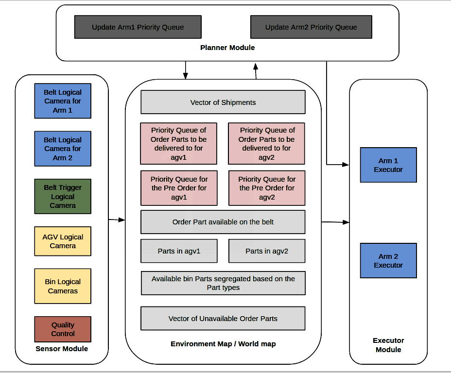

# [ARIAC 2019 Challange](https://bitbucket.org/osrf/ariac/wiki/2019/Home)

--------------------------------------------------------------------------------

## Overview

C++ project to build and dispatch kits for a given order based on the parts available in the bin and the conveyor belt.
## Authors 
- [Saurav Kumar](https://www.linkedin.com/in/sauravkdeo/)
- [Rachith Prakash](https://www.linkedin.com/in/rachithprakash)
- [Srinivas Iskala](https://www.linkedin.com/in/raja-srinivas-iskala-6631aa118/)
- [Dinesh Kadirimangalam](https://www.linkedin.com/in/dkadiri/)
- Sanket Acharya
- Preyash Parikh

## Results

<p align="center">

</p>

## Drop Part Challenge Result

<p align="center">

</p>

## Picking Part from Belt 

<p align="center">

</p>

## Algorithm

 This project implements hybrid architecture, where Sensory Module, Planning module and Execution module works independently to achieve the goal to build the kit. The algorithm read the order , makes smart decision for the shipment with ```any``` tag , checks the parts availability in the tray and the bin and generate a priority queues of the order parts for both the arms.
  
### Architecture

<p align="center">

</p>

### Sensory Module

Senses the world and update the parts available in the world continuously

### Planning Module

Updates priority queues for arm1 and arm2 based on the parts availability and reach ability

### Execution Module
Acts on the immediate goal from the planner to pick and drop the part

## Dependencies

This project uses the following packages:

- ROS Melodic

- Ubuntu 18.04

- Packages Dependencies:

  - catkin
  - geometry_msgs
  - moveit_ros_planning_interface
  - moveit_visual_tools
  - osrf_gear
  - roscpp
  - sensor_msgs
  - std_msgs
  - std_srvs
  - trajectory_msgs

## Build Instruction

unzip the files to this location

```
  cd ~/catkin_ws/src/
```

and then run following command in the terminal

```
  cd ~/catkin_ws/src/
  cd ..
  catkin_make
```

## Run Instruction

open terminal and type the following command :

```
roslaunch ariac_2019_challange ariac_2019_challange.launch
roslaunch ur10_moveit_config move_group.launch arm_namespace:=/ariac/arm1
roslaunch ur10_moveit_config move_group.launch arm_namespace:=/ariac/arm2
rosrun ariac_2019_challange main_node
```

